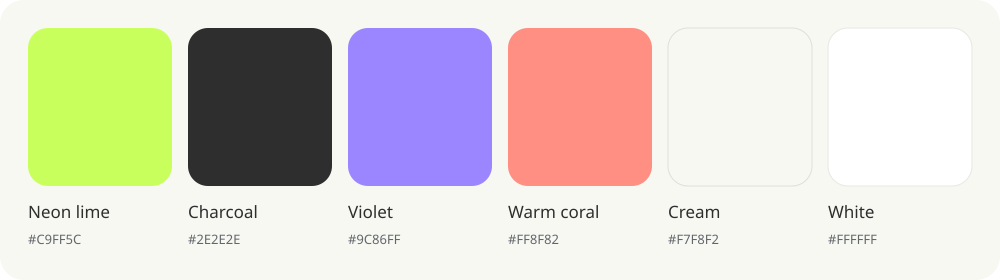

# Petey colour palette

Keep neon lime and charcoal as the recognisable Petey pair. Cream and white provide the everyday surfaces; violet and coral add contrast where the content needs it. Use one supporting accent at a time in ordinary UI. A chart can use two colours to distinguish its series.

The shared values live in [`tokens.css`](../src/shared/design/tokens.css). Use these tokens across the home page, signup, matching, trainer workspace, trainee inbox, profiles and reviewer tools. Do not add near-identical greens, grey-greens or purples to individual screens.

| Colour | Token | Value | Use |
| --- | --- | --- | --- |
| Neon lime | `--lime` | `#C9FF5C` | Primary actions, selected availability, conversion progress and active highlights |
| Charcoal | `--charcoal`, `--ink` | `#2E2E2E` | Main text and dark metric cards |
| Cream | `--cream` | `#F7F8F2` | Main app background |
| White | `--paper` | `#FFFFFF` | Profile cards, forms and floating surfaces |
| Violet | `--violet` | `#9C86FF` | Unlock chart lines, goal bars and occasional secondary accents |
| Warm coral | `--coral` | `#FF8F82` | Enquiry chart lines, markers, fills and occasional supporting artwork |
| Neutral grey | `--ink-soft` | `#62666D` | Supporting text on light surfaces |

## Applying the palette

- Use the exact lime, violet and warm coral tokens for accent fills, chart lines, progress bars and markers. Do not substitute darker or muted variants.
- Keep labels and icons charcoal or neutral grey on light surfaces, including coloured pills. Use charcoal text on lime, violet and coral; do not darken an accent to turn it into text. Keyboard focus uses charcoal.
- Use `--lime-soft`, `--violet-soft` and `--coral-soft` for subtle backgrounds such as messages, status pills and notices. These are shared mixes of the exact accent with white, not separately chosen colours. Unread/new states use lime, consultation/information uses violet, and waiting/attention uses coral, with visible text or icons explaining the state.
- Use `--cream-deep` for quiet neutral surfaces and `--line` for dividers and empty progress tracks. Use `--line-strong` for form boundaries. These all derive from charcoal and the page surfaces, avoiding olive and khaki casts.
- On charcoal, use `--chart-ink` for main labels and `--chart-muted` for secondary labels. Both derive from the cream/charcoal pair.
- Derive translucent overlays, shadows and hover treatments from the shared tokens with `color-mix`; do not introduce new hues. Keep the approved layouts, typography, photos and spacing.
- Error and success tokens keep their existing meanings. Accompany status and chart colours with labels and distinct marker shapes. The activity chart exposes exact values through its readout and keyboard-accessible date selection.

## Enquiry activity

The preview and live dashboard share `EnquiryActivityChart`. Its canvas matches the page's cream background. Enquiries use the exact warm coral (`--coral`, `#FF8F82`) and unlocks use the exact violet (`--violet`, `#9C86FF`) from the palette, including lines, markers and subtle area fills, with a floating white date readout. Legend controls show or hide each series. Mouse movement, touch and arrow keys select a recorded date; Home and End jump to the edges.

The chart uses [D3's monotone curves](https://d3js.org/d3-shape/curve#curveMonotoneX) to pass through the recorded values without creating extra peaks. Tooltips and accessible value announcements show the exact counts, including zeroes. The sample dashboard retains its received-date cohorts; the live dashboard keeps enquiries by received date and unlocks by unlock date. Each chart explains its grouping underneath.

Reduced-motion preferences remove the line entrance and readout animation. All existing page typography, spacing and profile-card layouts remain governed by the [design consistency guide](./design-consistency.md).
